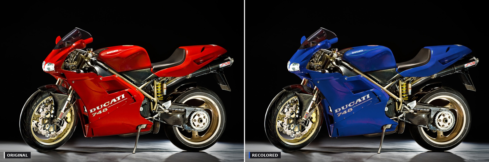
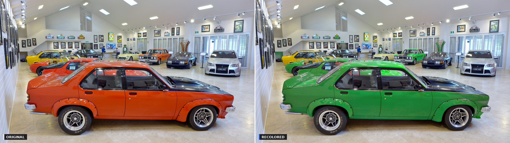
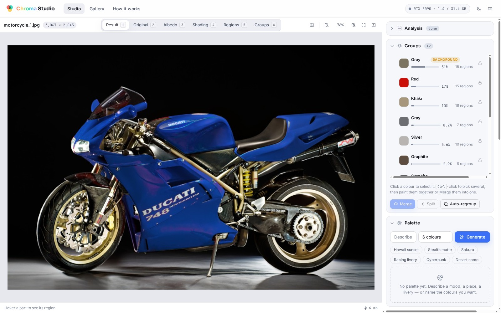

# Chroma Studio

**Photorealistic recoloring of product photographs.** Drop in a photo of a car, a
motorcycle, a sneaker, a model kit — type *"navy and gold"* or *"Hawaii sunset"* — and get
the same photograph with new paint, keeping every reflection, shadow, scratch and highlight
of the original.



The photo is decomposed into what the object **is** (reflectance) and how it was **lit**
(shading and specular light). Only the reflectance is edited, and the light on the edited
parts is re-derived from the new colour, so the result is a relit photograph rather than a
tinted one.



<sub>Photos: *Ducati 748 Studio* by Stefan Krause (CC BY-SA 3.0) and *Aravina Estate Sports
Car Gallery, 2015 (01)* by Bahnfrend (CC BY-SA 4.0), both via Wikimedia Commons; the
recolored versions are derivatives under the same licenses.</sub>

---

## Contents

- [What it does](#what-it-does)
- [How it works](#how-it-works)
- [Why it looks real](#why-it-looks-real)
- [Quick start](#quick-start)
- [Using the studio](#using-the-studio)
- [HTTP API](#http-api)
- [Project layout](#project-layout)
- [Performance](#performance)
- [Quality and testing](#quality-and-testing)
- [Limitations](#limitations)
- [Credits and licenses](#credits-and-licenses)

## What it does

```
photo ──► intrinsic decomposition ──► segmentation ──► colour groups ─┐
                                                                       ├──► mapping ──► render ──► export
prompt ──► reference images ──► palette ─────────────────────────────┘
```

- **Understands the photo.** Every part is found with SAM 2.1 — dense point grids and crop
  layers for busy scenes — then parts are grouped into the handful of paint colours a person
  actually sees ("the red", "the gold wheels", "the black frame").
- **Understands the prompt.** A theme name, colour words, or anything else: the palette comes
  from curated themes, parsed colour names, or chroma-weighted clustering of reference images
  fetched from Wikimedia Commons.
- **Maps old colours to new ones** with a Hungarian assignment (by area, lightness, hue or
  contrast), fully editable by drag-and-drop.
- **Renders in real time** on the GPU (about 10 ms per preview at 1024 px) and exports at the
  photo's full resolution.
- **Runs as a product**, not a notebook: a FastAPI backend with a job queue and server-sent
  progress, and a single-page studio UI with layer views, a before/after wipe, hover-to-
  highlight parts, group editing, keyboard shortcuts and a light/dark theme. GPU models load
  on the first job and unload after two idle minutes, so the card is only held while someone
  is actually working.



## How it works

| Stage | What it produces | How |
|---|---|---|
| **Intrinsic** | `albedo × shading + residual = image`, exactly | Careaga & Aksoy, *Colorful Diffuse Intrinsic Image Decomposition in the Wild* (SIGGRAPH Asia 2024), v2.1 weights, run at a 1536 px working resolution; an edge-aware Retinex-style fallback when the model is unavailable |
| **Segment** | one label per pixel, every part its own region | SAM 2.1 hiera-large automatic masks with three presets (Fast / Balanced / Max: 32 / 40 / 64 points per side and 0 / 1 / 2 crop layers), painted largest-first into a hierarchy; regions with two albedo modes are split; gaps are filled with SLIC superpixels; specks are merged away; edges are snapped to the image with a guided filter |
| **Group** | one entry per paint colour | area-weighted agglomerative clustering of each region's median albedo in CIEDE2000 (ΔE 10 by default, adjustable live); the group owning most of the image border is flagged as background |
| **Palette** | N target colours for a prompt | 57 curated themes and parsed colour words are honoured first; otherwise reference images are fetched from Wikimedia Commons and clustered by chroma-weighted k-means in Lab |
| **Map** | which old colour becomes which new colour | a `groups × colours` cost matrix (area rank, lightness order, hue distance or contrast) solved with the Hungarian algorithm; five strategies, any cell overridable |
| **Render** | the recolored photo | the GPU engine below: paints the albedo per group, recolours the light on the painted parts, rebuilds the residual, compresses out-of-gamut colours, and blends with edge-snapped coverage |

Full-resolution export re-runs the decomposition at native resolution (about 6 s for an
8 MP photo) and guided-upsamples the working-resolution layers above 12 MP.

## Why it looks real

Most "recolor" tools shift hue in the image and stop. That fails on real photographs in
specific, visible ways, and the engine ([`recolor/engine.py`](recolor/engine.py)) exists
to handle each of them. Every rule below was a user-visible bug once and has a regression
test.

1. **Paint the reflectance, not the pixels.** The shading layer (soft light, shadows) and the
   residual (specular highlights, sensor clipping) are untouched by the colour change, so the
   modelling of the surface survives.
2. **Carry the paint's texture into the new hue.** A real albedo is not flat: it is a little
   more saturated here, a little darker there. That deviation from the group colour is kept —
   scaled by `min(1, C_target / C_source)` so a red car painted grey does not turn into a
   rainbow, and **rotated into the target's hue frame** so "a bit more saturated red" becomes
   "a bit more saturated navy" rather than "navy plus magenta". The same rotation keeps a
   white decal white.
3. **Anchor lightness on the part's own lightness.** `L' = T_L + slope·(L − A_L)`, slope 1
   above the anchor and `T_L / A_L` below it, so highlights keep their modelling while the
   darker half is compressed into the room the new colour actually has, instead of clipping
   to a flat black silhouette on every dark target.
4. **Recolour the bounce light.** The decomposition leaks part of a saturated surface into
   its shading, most in shadows and concavities (a red tank's shadows come out lit by light
   five times redder than the scene's). Per pixel, the light's tint beyond the scene's own
   illuminant — estimated from well-lit neutral surfaces, like a white balance — is split
   along the old paint's chroma direction; the aligned part is mapped to the new paint the
   same way the albedo is, the rest is kept.
5. **Split the residual at its achromatic floor.** On a saturated surface the residual also
   carries diffuse energy in the *old* colour. Added back unchanged it survives every
   repaint (red painted black comes out maroon). The coloured excess is rebuilt as a multiple
   of the repainted surface; the neutral floor is kept where it is a sharp glint and faded
   where it is only a veil.
6. **Never leave a rim of the old paint.** A symmetric blur of the group mask dips below 1
   *inside* the part, leaving a coloured outline around every panel. Coverage is instead
   snapped to the photograph's own edges with a colour guided filter, maxed with the hard
   label, and ramped outward only.
7. **Compress chroma instead of clipping channels** when a colour leaves the sRGB gamut, so
   bright repaints do not blow out and dark ones do not go muddy.

The full contract for every module is in [docs/ARCHITECTURE.md](docs/ARCHITECTURE.md).

## Quick start

Requirements: Linux, Python 3.13, a CUDA GPU (developed on an RTX 5090; the two models
take about 4 GB of VRAM while loaded), and a base Python environment that already has
PyTorch with CUDA — the setup script layers a venv on top of it.

```bash
git clone https://github.com/Gilbert-Wang-30/chroma-studio.git
cd chroma-studio
./setup.sh                      # venv, packages, SAM 2.1 + Intrinsic v2.1 weights (~4 GB)
.venv/bin/python serve.py       # prints the LAN and Tailscale URLs, default port 8810
```

`serve.py` binds every interface and prints the addresses another machine can use. Models
load on the first analysis (20–30 s, once) and unload after two idle minutes; `--warmup`
preloads them at startup. Environment variables: `RECOLOR_PORT` (default 8810) and
`RECOLOR_IDLE_UNLOAD_S` (default 120, `0` keeps models resident). If a firewall is active,
open the port (`sudo ufw allow 8810/tcp`).

Thirty-five CC-licensed sample photos ship in [`samples/`](samples/) (cars, motorcycles,
bicycles, sneakers, robot toys, fifteen Gunpla kits and sprues, busy street and interior
scenes; sources and licenses in
[`samples/MANIFEST.json`](samples/MANIFEST.json)) and appear on the home page as
"Try a sample".

## Using the studio

1. **Home** — drop, paste or pick a photo, choose a detail level (Fast / Balanced / Max) and
   analyze. A five-step stepper shows progress from the server's event stream.
2. **Studio** — the workspace.
   - *Viewer*: layer tabs (Result · Original · Albedo · Shading · Regions · Groups), a
     before/after wipe, pan and zoom, and hover-to-highlight of the part under the cursor.
     Click selects a group; Ctrl/⌘-click or `A` selects several; `M` merges the selection;
     `1–6` switch layers; hold `Space` to peek at the original; `Ctrl/⌘+Z` undoes a mapping
     change.
   - *Groups*: swatches with area bars and region counts; rename, lock (never repainted),
     drag one group onto another to merge, split a group, or re-cluster with the ΔE slider.
     Ctrl-click any part on the canvas to add its group to the selection and "Paint all N".
   - *Palette*: a prompt (with suggestions), a colour count, Generate. Source thumbnails
     show their attribution; swatches can be edited, added, removed and reordered.
   - *Mapping*: a strategy (Balanced / Area / Luminance / Hue / Contrast) plus "Suggest";
     drag any palette swatch onto a group row, or pick a colour per row. Every change
     re-renders the preview (debounced, in-flight requests cancelled).
   - *Finish*: texture, feather, shading strength, highlight tint and saturation sliders with
     live preview, then export at working or full resolution as PNG or JPG.
3. **Gallery** — every analyzed job with thumbnails; **How it works** — an animated
   walkthrough of the pipeline.

The frontend is plain HTML, CSS and ES modules under [`web/`](web/) — no build step, no
framework. `web/mock/mock-server.py` fakes the whole API (including progress events) for UI
work without a GPU.

## HTTP API

The UI is a client of the same JSON API you can script against (interactive docs at
`/api/docs`).

| Method | Path | Purpose |
|---|---|---|
| `GET` | `/api/health` | device, VRAM, model state, queue length |
| `GET` | `/api/samples`, `/api/samples/{name}` | bundled sample photos |
| `POST` | `/api/jobs` | upload a photo (or name a sample) and start analysis; `detail` = fast / balanced / max, optional `max_groups`, `delta_e` |
| `GET` | `/api/jobs`, `/api/jobs/{id}` | job list and job state (regions, groups, timings) |
| `GET` | `/api/jobs/{id}/events` | server-sent progress events |
| `GET` | `/api/jobs/{id}/layers/{layer}` | original, albedo, shading, regions, groups, preview, … |
| `GET` | `/api/jobs/{id}/ids/{kind}` | lossless id maps for hover and selection |
| `POST` | `/api/jobs/{id}/groups/merge` · `split` · `move`, `/regroup` | edit the colour groups |
| `POST` | `/api/palettes` | build a palette from a prompt (`prompt`, `n_colors`) |
| `POST` | `/api/jobs/{id}/mapping/suggest` | Hungarian assignment for a palette and strategy |
| `POST` | `/api/jobs/{id}/render` | preview JPEG for a mapping + options; `X-Render-Ms` header |
| `POST` | `/api/jobs/{id}/export` | full or working resolution, PNG or JPG |
| `PUT` | `/api/jobs/{id}/state` | persist the studio's mapping and options |
| `DELETE` | `/api/jobs/{id}` | remove a job |

Render options (`RenderOptions`): `mode` (`shift` keeps texture, `flat` paints solid),
`texture`, `feather_px`, `keep_residual`, `residual_tint`, `shading_strength`, `saturation`.

```python
# scripts/e2e.py drives a running server end to end:
.venv/bin/python scripts/e2e.py --samples motorcycle_1.jpg --prompt "navy and gold"
```

## Project layout

```
recolor/              python package
  intrinsic/          Careaga v2.1 wrapper (lazy singleton, release()), heuristic fallback
  segmentation/       SAM 2.1 masks, superpixels, hierarchy (merge/split/fill), grouping
  palette/            Wikimedia sources, k-means extraction, themes and colour words
  mapping.py          old → new colour assignment strategies (Hungarian)
  engine.py           GPU recoloring engine
  filters.py          box / guided (grey and colour) filters, label refinement
  pipeline.py         stage orchestration, artifacts, renderer cache, idle GPU unload
  jobs.py             job registry and event streams
  server/app.py       FastAPI routes
web/                  the studio (index.html, app.css, js/ modules, mock/ fake API)
scripts/              model-backed dev scripts (dev_intrinsic, dev_segment, dev_palette, dev_render, e2e)
tests/                190 fast unit tests: no models, no network, no GPU required
samples/              CC-licensed test photos with MANIFEST.json
docs/                 ARCHITECTURE.md (module contracts), demo images
```

## Performance

Measured on an RTX 5090 at the 1536 px working resolution:

| | |
|---|---|
| Analysis, Balanced detail | 7–9 s per photo (SAM 2 is 5–6 s of that) |
| Analysis, Max detail, busy street scene | 23 s |
| Preview render (1024 px) | 10–70 ms, cached layers per size |
| Full-resolution export, 8 MP, with native-resolution decomposition | ≈ 6 s |
| GPU memory while models are loaded | ≈ 4 GB, released after 2 idle minutes |

## Quality and testing

```bash
.venv/bin/python -m pytest tests/ -q          # 190 tests in ~4 s
```

The engine is also scored by a measurement harness on six analyzed photos (a yellow BMW,
the red Ducati, an orange coupe and three Gunpla kits): **halo** (old paint still visible
on or beside a repainted part), **bleed** (repaint leaking onto untouched parts), **jaggy**
(boundary sharpness versus the photo), **interior ΔE** (how close the repainted interior is
to the requested colour) and **identity** (an empty mapping must reproduce the original bit
for bit). The edge-snapped coverage cut total halo pixels from 83 k to 11.5 k across the
set with identity at 0.

Segmentation, palette and rendering each have a script in [`scripts/`](scripts/) that writes
inspection sheets, and `scripts/e2e.py` exercises a running server across the sample set.

## Limitations

- One paint sometimes ends up as several colour groups when its albedo keeps residual
  shading (a blown-out highlight or a deep shadow can cluster apart). Multi-select and
  "Paint all", or Merge, handles it in two clicks; automatic absorption is future work.
- The Intrinsic model separates diffuse colour from light, not material: chrome, glass and
  transparent parts recolour as if they were paint, so lock those groups.
- Auto-mapping recolours scene backgrounds unless their group is locked; only one group is
  flagged as background automatically.
- Full-resolution export above 12 MP upsamples the working-resolution layers instead of
  re-running the decomposition.

## Credits and licenses

- Code: [MIT](LICENSE).
- [Segment Anything 2.1](https://github.com/facebookresearch/sam2) — Meta AI, Apache 2.0.
- [Colorful Diffuse Intrinsic Image Decomposition in the Wild](https://github.com/compphoto/Intrinsic)
  — Chris Careaga and Yağız Aksoy, SFU Computational Photography Lab; weights are for
  non-commercial academic use, so a deployment of this project inherits that restriction.
- Reference and sample imagery — Wikimedia Commons contributors; licenses are recorded per
  image in `samples/MANIFEST.json` and shown per source image in the app.
