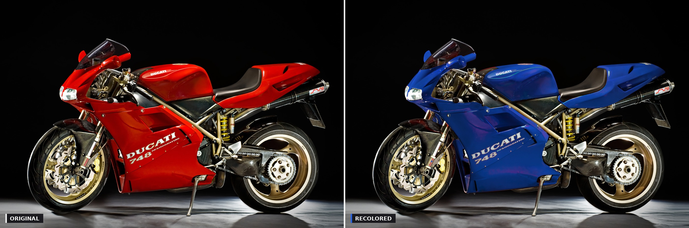
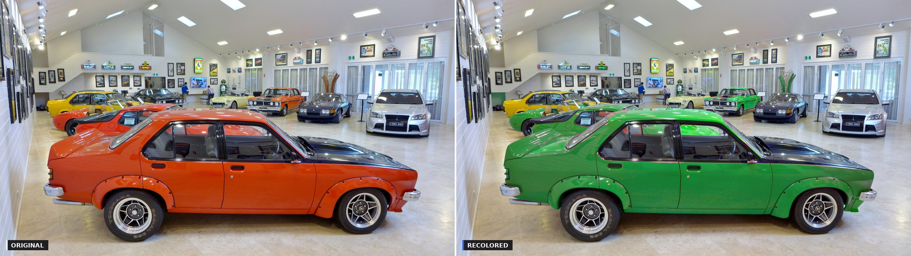
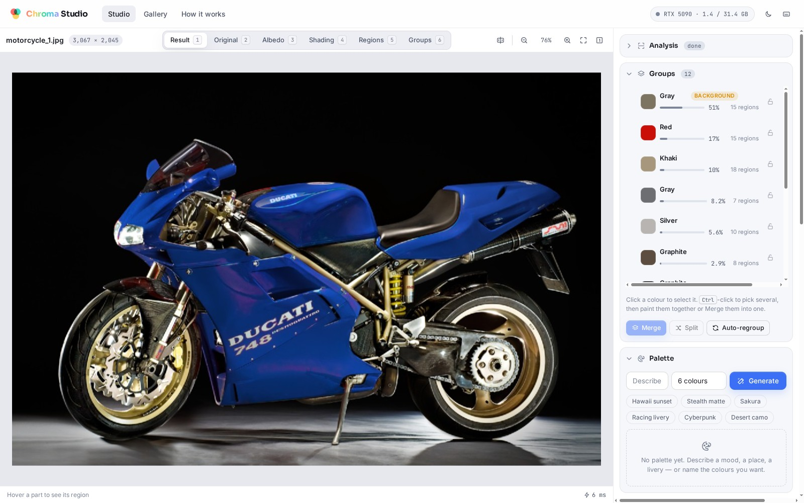

# Chroma Studio

**Photorealistic recoloring of product photographs.** Drop in a photo of a car, a
motorcycle, a sneaker, a model kit — type *"navy and gold"* or *"Hawaii sunset"* — and get
the same photograph with new paint, keeping every reflection, shadow, scratch and highlight
of the original.



The photo is decomposed into what the object **is** (reflectance) and how it was **lit**
(shading and specular light). Only the reflectance is edited, and the light on the edited
parts is re-derived from the new colour, so the result is a relit photograph rather than a
tinted one.



<sub>Photos: *Ducati 748 Studio* by Stefan Krause (CC BY-SA 3.0) and *Aravina Estate Sports
Car Gallery, 2015 (01)* by Bahnfrend (CC BY-SA 4.0), both via Wikimedia Commons; the
recolored versions are derivatives under the same licenses.</sub>

---

## Contents

- [What it does](#what-it-does)
- [How it works](#how-it-works)
- [Why it looks real](#why-it-looks-real)
- [Quick start](#quick-start)
- [Using the studio](#using-the-studio)
- [HTTP API](#http-api)
- [Project layout](#project-layout)
- [Performance](#performance)
- [Quality and testing](#quality-and-testing)
- [Limitations](#limitations)
- [Credits and licenses](#credits-and-licenses)

## What it does

```
photo ──► intrinsic decomposition ──► segmentation ──► colour groups ─┐
                                                                       ├──► mapping ──► render ──► export
prompt ──► reference images ──► palette ─────────────────────────────┘
```

- **Understands the photo.** Every part is found with SAM 2.1 — dense point grids and crop
  layers for busy scenes, a second, zoomed-in look at small coloured spots the first pass
  swallowed into a larger part (a gold fork tube inside the black machinery), lettering
  and named parts read by Florence-2 (a fairing decal, a tyre and its rim), and a
  foreground matte (BiRefNet) that tells the object from its backdrop — then parts are
  grouped into the handful of paint colours a person actually sees ("the red", "the gold
  wheels", "the black frame"), with one paint under different light kept as one colour and
  the background set aside (another car parked right behind the subject goes with the
  background, even where the matte took it in). The parts people personalise (a shock spring,
  a grip, the brake calipers, the rims and tyres of both wheels, a seat, a grille, the mirrors)
  are recognised with OWLv2 (the calipers and the brake disc by a second, zoomed-in look inside
  every wheel) and each kept as a named group of its own whatever its colour, while a sliver
  that is only a shadow of its neighbour, the shadowed rim of a part, or a group of crumbs is
  folded back into it.
- **Understands the prompt.** A theme name, colour words, or anything else: the palette comes
  from curated themes, parsed colour names, or chroma-weighted clustering of reference images
  fetched from Wikimedia Commons.
- **Maps old colours to new ones** with a Hungarian assignment (by area, lightness, hue or
  contrast), fully editable by drag-and-drop.
- **Renders in real time** on the GPU (6-9 ms per preview at 1024 px) and exports at the
  photo's full resolution.
- **Runs as a product**, not a notebook: a FastAPI backend with a job queue and server-sent
  progress, and a single-page studio UI with layer views, a before/after wipe, hover-to-
  highlight parts, group editing, keyboard shortcuts and a light/dark theme. GPU models load
  on the first job and unload after two idle minutes, so the card is only held while someone
  is actually working.



## How it works

| Stage | What it produces | How |
|---|---|---|
| **Intrinsic** | `albedo × shading + residual = image`, exactly | Careaga & Aksoy, *Colorful Diffuse Intrinsic Image Decomposition in the Wild* (SIGGRAPH Asia 2024), v2.1 weights, run at a 1536 px working resolution; an edge-aware Retinex-style fallback when the model is unavailable |
| **Segment** | one label per pixel, every part its own region | SAM 2.1 hiera-large automatic masks with three presets (Fast / Balanced / Max: 32 / 40 / 64 points per side and 0 / 1 / 2 crop layers), painted largest-first into a hierarchy; a small proposal that stands out from its surroundings (an indicator, a decal) is kept even below the preset's minimum area; regions with two albedo modes are split, and the split products are split again until nothing is left mixed; gaps are filled with SLIC superpixels; specks are merged away; edges are snapped to the image with a guided filter. At Balanced and Max, Florence-2 reads the lettering and names the parts (tyres, rims, discs, lamps, mirrors, emblems), SAM is prompted on those boxes (a wheel is split into tyre and rim along its rim-lip ellipse) and, zoomed in, on small coloured spots inside neutral regions and on off-colour pieces of coloured regions (a gold part swept into the paint's region); every part it returns gets its own region. A BiRefNet foreground matte then cuts regions along the object's silhouette and marks the backdrop, floor and wall regions. Then the parts people personalise are detected: Florence-2's caption names the object (a motorcycle, a car, a bicycle, a sneaker, a figure), OWLv2 looks for that class's parts (shock springs, grips, rims, tyres, seats, exhausts, sprockets, grilles, mirrors, bumpers, door handles, logos...), SAM draws each box it is sure of, and every mask that passes the gates (detector and SAM confidence, box agreement, on the object, a sane size for the part) is stamped as a region of its own, one per instance (a wheel's rim and tyre along the rim's lip, even when a swingarm cuts deep into the wheel or the rim is black in a black tyre); every wheel found is looked at again for its brake caliper (OWLv2 on crops of the wheel and of each candidate, and a caliper painted in a colour found nowhere else in the wheel) and its brake disc; last, SAM draws the subject's own silhouette, and another object of its kind that the matte took in (a car parked right behind it) is given to the backdrop |
| **Group** | one entry per paint colour, plus one per detected part | area-weighted agglomerative clustering of each region's median albedo in CIEDE2000 (ΔE 10 by default, adjustable live), backdrop and object regions apart, with every detected part kind held out as a group of its own ("Shock spring", "Wheel rims"), whatever its colour and however small, then the lit and shadowed pieces of one paint are merged (same lightness-normalised albedo and photo colour, not another material); refined for the engine: paint washed out by a highlight, and the highlight zones of a paint that clustered as white, join their paint; white lettering (and a clear lens or white part at the paint's edge that belongs to its neighbour) is carved out of the paint as a "decal island" and the paint's own colour between the letters of a decal, and inside the letters' counters (the holes of an "8"), goes back to the paint; the paint's edges are snapped to the photo with ViTMatte alpha mattes; other materials in the paint's hue (a gold caliper, and a recovered part that clustering put into the paint, like a gold fork tube on a yellow bike) are locked; objects of the paint's colour in their own right (a brake-fluid reservoir) are protected from the reflection stage; every group carries a shininess and an advisory shiny / chrome badge; every backdrop group is flagged as background. Last, tiny groups that are only a lighting variant of a touching group are folded into it: the shadowed rim a detected part's mask left around it, a shadow the intrinsic shading layer explains (darker, the hue kept or the light's own cast), a seam with no edge in the photo, or a sliver nobody can tell from its neighbour, or a group that is only crumbs of a few pixels (lettering, decals, recovered parts and detected parts are never folded, and a region you locked or marked goes only into a group that keeps your choice), and the paint under a glossy sheen (lighter and duller in the same hue: a roof facing the showroom's lights) joins the paint |
| **Palette** | N target colours for a prompt | 57 curated themes and parsed colour words are honoured first; otherwise reference images are fetched from Wikimedia Commons and clustered by chroma-weighted k-means in Lab |
| **Map** | which old colour becomes which new colour | a `groups × colours` cost matrix (area rank, lightness order, hue distance or contrast) solved with the Hungarian algorithm; five strategies, any cell overridable |
| **Render** | the recolored photo | the GPU engine below: paints the albedo per group, recolours the light on the painted parts, rebuilds the residual, compresses out-of-gamut colours, and blends with edge-snapped coverage |

Full-resolution export re-runs the decomposition at native resolution (about 6 s for an
8 MP photo) and guided-upsamples the working-resolution layers above 12 MP.

## Why it looks real

Most "recolor" tools shift hue in the image and stop. That fails on real photographs in
specific, visible ways, and the engine ([`recolor/engine.py`](recolor/engine.py)) exists
to handle each of them. Every rule below was a user-visible bug once and has a regression
test.

1. **Paint the reflectance, not the pixels.** The shading layer (soft light, shadows) and the
   residual (specular highlights, sensor clipping) are untouched by the colour change, so the
   modelling of the surface survives.
2. **Work in OKLab.** CIELAB's hue lines bend toward purple on desaturated blues (a navy
   repaint of a yellow bike read violet); OKLab keeps the hue on the target. Lightness runs
   on a CIELAB-like toe so black repaints are not crushed.
3. **Carry the paint's texture into the new hue.** The albedo's deviation from the group
   colour is kept, scaled by `min(1, C_target / C_source)` and **rotated into the target's
   hue frame**, so "a bit more saturated red" becomes "a bit more saturated navy" and a white
   decal stays white. Lightness is anchored on the part's own lightness, and dark targets
   keep less of the albedo's texture, which otherwise turned into grey blotches on black.
4. **Recolour the bounce light.** The decomposition leaks part of a saturated surface into
   its shading, most in shadows (a red tank's shadows come out lit five times redder than
   blue). The light's tint beyond the scene illuminant, along the old paint's direction, is
   mapped to the new paint.
5. **Split the residual at its achromatic floor.** The coloured excess is rebuilt in the new
   colour (red painted black no longer comes out maroon), and a darker target keeps only part
   of its energy (kept whole, a yellow bike's residual lifted a navy repaint to royal blue);
   the neutral floor is kept where it is a glint, faded where it is a veil, and limited at
   group boundaries, where it drew a light hairline around every silhouette of a dark repaint.
6. **Keep the photo's highlights.** At sensor-clipped white highlights the albedo's magenta
   error is not rotated into the new hue (it made cyan fringes) and the light there is the
   lamp's. A repaint never falls below the photo's own white specular, estimated against how
   white the paint looks at that brightness, so glossy black stays glossy without the lit
   flank turning into grey marble. Black is rendered as the darkest real paint lit by the
   photo's shading, so it keeps its form, and the shadows of a pastel keep their chroma.
7. **Recolour the old paint's reflections.** A red tank shows in the chrome fork, the
   caliper and the floor. Pixels outside the repainted parts that still show the old paint
   (colour, hue window, distance, darker than the paint) take the new colour; locked parts,
   parts with a colour of their own, protected objects and parts that are mostly that
   colour themselves (a warm backdrop behind repainted gold parts) are never touched.
8. **Never leave a rim of the old paint, never paint the neighbour.** Coverage is snapped to
   the photograph's own edges with a colour guided filter and ramped outward only, never
   below the hard label, and the ramp only enters pixels that still hold some of the old
   paint, so a silhouette against a white backdrop stays clean, or where the photo's own edge
   is soft (a defocused part keeps a soft edge); carved decal islands are never entered, so
   white lettering keeps its shape.
9. **Compress chroma instead of clipping channels** when a colour leaves the sRGB gamut, so
   bright repaints do not blow out and dark ones do not go muddy.
10. **Repaint white paint as paint, not as light.** On a white or light-grey paint the
    decomposition leaves the white's own brightness in the residual and above the paint's
    lightness in the albedo, and rules 3, 5 and 6, written for coloured paint, kept all of it as
    glints: a navy repaint of the white Alpine came out cornflower on every lit face with the
    target only in the shadows, black as grey marble, a pastel blown to white. A neutral source
    (CIELAB chroma under 10 to 18, light enough or white in the photo, not chrome) rebuilds that
    leftover in the new paint like the rest of its light, keeps no texture above its own lightness,
    never reflects more than a white paint under that light would (photo x new albedo / 0.8), keeps
    no gloss floor of its own and is no source for rule 7's reflections. Its real glints stay: a
    small clipped white spot that stands out from the lit paint around it and that the shading
    layer does not explain (a lit bevel or crease is in the shading) is added back as the lamp's
    white light, whole and white once it is clearly a glint, so the Alpine keeps its roof streak, the
    Unicorn its sun streak and the model ship its row of lamp reflections.
    These rules are for white paint only: a grey that glints like metal or a clear coat, with neither
    a white albedo nor a white photo (a motorcycle's cast fork leg, a bike's glossy white-and-silver
    parts in a dim photo, a wall whose sheen reads as glints), keeps the coloured-paint rules and its
    reflections. They fade out as the target nears the source colour, so picking a group's own swatch
    colour leaves it as it was, and every one of them comes in gradually: a glint below the limits dims
    instead of switching off, and a grey's gloss is counted softly. A full-resolution export keeps
    exactly the preview's glints and treats every group as the preview did. White paint that the
    analysis took into a dark decal (the leather between a sneaker's FILA letters) is repainted with
    the paint. Over six white photos and six targets the washout score fell from 9.48 to 0.45;
    coloured paints render bit for bit as before.

The full contract for every module is in [docs/ARCHITECTURE.md](docs/ARCHITECTURE.md).

## Quick start

Requirements: Linux, Python 3.13, a CUDA GPU (developed on an RTX 5090; the models take
about 4 GB of VRAM while loaded), and a base Python environment that already has PyTorch
with CUDA — the setup script layers a venv on top of it and never replaces that torch.

```bash
git clone https://github.com/Gilbert-Wang-30/chroma-studio.git
cd chroma-studio
./setup.sh                      # venv, packages, SAM 2.1, Intrinsic v2.1, ViTMatte, Florence-2, BiRefNet, OWLv2 weights (~7 GB)
.venv/bin/python serve.py       # prints the LAN and Tailscale URLs, default port 8810
```

`serve.py` binds every interface and prints the addresses another machine can use. Models
load on the first analysis (20–30 s, once) and unload after two idle minutes; `--warmup`
preloads them at startup. Without `transformers` or the ViTMatte, Florence-2, BiRefNet or
OWLv2 weights the analysis still runs (the guided filter snaps the edges, no lettering or named
parts, the border rule decides the background, no detected parts; each logged once); the weights are read from
the local cache only, never downloaded during an analysis, so run `./setup.sh` to get
them. Environment variables: `RECOLOR_PORT` (default 8810) and
`RECOLOR_IDLE_UNLOAD_S` (default 120, `0` keeps models resident). If a firewall is active,
open the port (`sudo ufw allow 8810/tcp`).

Thirty-seven CC-licensed sample photos ship in [`samples/`](samples/) (cars, motorcycles,
bicycles, sneakers, robot toys, fifteen Gunpla kits and sprues, busy street and interior
scenes; sources and licenses in
[`samples/MANIFEST.json`](samples/MANIFEST.json)) and appear on the home page as
"Try a sample".

## Using the studio

1. **Home** — drop, paste or pick a photo, choose a detail level (Fast / Balanced / Max) and
   analyze. A five-step stepper shows progress from the server's event stream.
2. **Studio** — the workspace.
   - *Viewer*: layer tabs (Result · Original · Albedo · Shading · Regions · Groups), a
     before/after wipe, pan and zoom, and hover-to-highlight of the part under the cursor.
     Click selects a group; Ctrl/⌘-click or `A` selects several; `M` merges the selection;
     `1–6` switch layers; hold `Space` to peek at the original; `Ctrl/⌘+Z` undoes a mapping
     change.
   - *Groups*: an "Ignore background" switch (on by default: the backdrop, floor and wall
     groups are locked, dimmed and left out of suggestions; a scene whose background is
     fragmented into many groups, a street or a showroom, opens with it off; any group can be
     marked or unmarked as
     background from its row), then swatches with area bars, region counts and a shiny /
     chrome badge where the layers show glints or reflections, in four sections: **Parts**
     (the detected parts, each named after what it is, "Shock spring", "Wheel rims", with a
     Part badge: paint the spring without the frame, the rims without the body), **Colours**
     (the paints), **Minor** (tiny groups in the colour of the group next to them, mostly its
     shadow or reflection, collapsed under a divider: a click opens them, each says which group
     it sits next to and merges into it in one click; a tiny part of a colour of its own stays
     among the colours) and
     **Background** (last, collapsed while the background is ignored). Rename, lock (never
     repainted), drag one group onto another to merge, split a group (a part with several
     instances, "Tyres" or "Brake calipers", splits into "Tyre (front)" and "Tyre (rear)" on a
     vehicle whose front the parts give away, "(left)" and "(right)" or numbered otherwise,
     painted exactly as before until you give them different colours, and a merge joins them
     again), or re-cluster with the group-count slider (it caps the colour clustering; a
     detected part, a part locked as another material or a decal keeps a group of its own, so
     the toast gives the real count; a regroup keeps your locks, background choices and the
     names you gave). Ctrl-click any part on the canvas to add its
     group to the selection and "Paint all N".
   - *Select part* (the wand in the toolbar, `S`, or Alt-click): point at a part the automatic pass
     missed and SAM 2 cuts it out. Click the part, Shift-click or right-click what is not part of it,
     or drag a box; the outline follows every click in about 25 ms. `N` tries SAM's other shapes
     for one click, `Backspace` undoes a point, `Esc` cancels, and `Enter` (with an optional name)
     makes it a group of its own with the Part badge, selected and ready to paint (a focused button
     keeps Enter and Space for itself; Enter pressed before the outline shows waits for it). The keys
     are in the status bar; the pill says first what Enter will do: a part it covers almost whole,
     or a colour group it covers whole, is taken in whole ("takes in Bolt"), and one that makes up
     most of the new part is replaced, its name and paint kept ("replaces Far caliper": selecting a
     part again gives it a new outline). A part it covers half of or more but not almost whole is cut
     ("cuts Shock spring (32 % stays)"), and *Take all* next to Make group takes all of it instead.
     No other group is renamed (a part's automatic name follows its instance count), relocked,
     unmarked as background or repainted. It stays its own group through Auto-regroup and is never
     folded as junk; its row's Remove undoes it: every pixel goes back to the region it came from,
     its paint goes with it, and every group it took in whole comes back with its name, flags and
     paint. *Find part*, above the Groups list, looks a part up by name ("spring", "caliper",
     "muffler"): the part groups that name matches come first (a check; a click selects the group),
     then up to five candidates from OWLv2 (asked with synonyms too: "mirror" also as "rear view
     mirror") are outlined on the image, and a click on one takes it into Select part. A candidate
     that is a detected part of another kind (an alert icon) comes last.
   - *Palette*: a prompt (with suggestions), a colour count, Generate. Source thumbnails
     show their attribution; swatches can be edited, added, removed and reordered.
   - *Mapping*: a strategy (Balanced / Area / Luminance / Hue / Contrast) plus "Suggest";
     drag any palette swatch onto a group row, or pick a colour per row. Every change
     re-renders the preview (debounced, in-flight requests cancelled).
   - *Finish*: texture, feather, shading strength, highlight tint and saturation sliders with
     live preview, then export at working or full resolution as PNG or JPG.
3. **Gallery** — every analyzed job with thumbnails; **How it works** — an animated
   walkthrough of the pipeline.

The frontend is plain HTML, CSS and ES modules under [`web/`](web/) — no build step, no
framework. `web/mock/mock-server.py` fakes the whole API (including progress events) for UI
work without a GPU.

## HTTP API

The UI is a client of the same JSON API you can script against (interactive docs at
`/api/docs`).

| Method | Path | Purpose |
|---|---|---|
| `GET` | `/api/health` | device, VRAM, model state, queue length |
| `GET` | `/api/samples`, `/api/samples/{name}` | bundled sample photos |
| `POST` | `/api/jobs` | upload a photo (or name a sample) and start analysis; `detail` = fast / balanced / max, optional `max_groups`, `delta_e` |
| `GET` | `/api/jobs`, `/api/jobs/{id}` | job list and job state (regions, groups, timings) |
| `GET` | `/api/jobs/{id}/events` | server-sent progress events |
| `GET` | `/api/jobs/{id}/layers/{layer}` | original, albedo, shading, regions, groups, preview, …; `?w=` for a cached thumbnail |
| `GET` | `/api/jobs/{id}/ids/{kind}` | lossless id maps for hover and selection |
| `POST` | `/api/jobs/{id}/groups/merge` · `split` · `move`, `/regroup` | edit the colour groups; merge takes `into` (the group the others join) and `dissolve` (`{group_ids: [part], dissolve: true}` removes a drawn part) |
| `POST` | `/api/jobs/{id}/segment` | SAM 2 prompted by points `[x, y, 1\|0]` (work pixels) and / or a box: the mask as a 1-bit PNG of its box, its area and score, the alternatives; `{}` prepares the embedding; 503 with `Retry-After` while an analysis holds the GPU |
| `POST` | `/api/jobs/{id}/groups/from_mask` | the same prompt (run again on the server) plus an optional `name` and `take` (groups under the selection to take in whole): the part becomes a group of its own (`created_part` says which groups it took in and which one it replaces) |
| `POST` | `/api/jobs/{id}/find` | `{text}`: the part groups the phrase names (`existing`), then candidate parts (OWLv2 boxes for the phrase and its synonyms, as SAM masks), each with the prompt that commits it and the part group it already is (`matches`, `named`); five in all |
| `PATCH` | `/api/jobs/{id}/groups/{gid}` | rename (1 to 48 characters), lock, mark as background |
| `POST` | `/api/palettes` | build a palette from a prompt (`prompt`, `n_colors`) |
| `POST` | `/api/jobs/{id}/mapping/suggest` | Hungarian assignment for a palette and strategy |
| `POST` | `/api/jobs/{id}/render` | preview JPEG for a mapping + options; `X-Render-Ms` header |
| `POST` | `/api/jobs/{id}/export` | full or working resolution, PNG or JPG |
| `PUT` | `/api/jobs/{id}/state` | persist the studio's mapping, options and the ignore-background setting |
| `DELETE` | `/api/jobs/{id}` | remove a job |

Render options (`RenderOptions`): `mode` (`shift` keeps texture, `flat` paints solid),
`texture`, `feather_px`, `keep_residual`, `residual_tint`, `shading_strength`, `saturation`.

```python
# scripts/e2e.py drives a running server end to end:
.venv/bin/python scripts/e2e.py --samples motorcycle_1.jpg --prompt "navy and gold"
```

## Project layout

```
recolor/              python package
  intrinsic/          Careaga v2.1 wrapper (lazy singleton, release()), heuristic fallback
  segmentation/       SAM 2.1 masks and prompts (Select part), superpixels, hierarchy (merge/split/fill, lettering,
                      wheels, named parts, the matte cut), detected parts (vocabulary, gates,
                      stamping), Florence-2, BiRefNet and OWLv2 wrappers, grouping (backdrop,
                      parts, one paint under different light, the panel view), materials
                      (shininess, highlights), refinement (absorb, decals, locks, protect),
                      junk pruning, ViTMatte edge snap, user parts (the carve and its upkeep)
  palette/            Wikimedia sources, k-means extraction, themes and colour words
  mapping.py          old → new colour assignment strategies (Hungarian)
  engine.py           GPU recoloring engine
  filters.py          box / guided (grey and colour) filters, label refinement
  pipeline.py         stage orchestration, artifacts, renderer cache, idle GPU unload
  jobs.py             job registry and event streams
  server/app.py       FastAPI routes
web/                  the studio (index.html, app.css, js/ modules, mock/ fake API)
scripts/              model-backed dev scripts (dev_intrinsic, dev_segment, dev_palette, dev_render, e2e)
tests/                513 fast unit tests: no models, no network, no GPU required
samples/              CC-licensed test photos with MANIFEST.json
docs/                 ARCHITECTURE.md (module contracts), demo images
```

## Performance

Measured on an RTX 5090 at the 1536 px working resolution:

| | |
|---|---|
| Analysis, Balanced detail | 10–12 s per photo once the models are loaded (SAM 2 is 5–6 s of that; lettering, named parts and the zoomed second look at small parts 1–2.5 s; the matte 0.1–0.5 s; the detected parts 0.4–1.2 s, of which the second look inside the wheels (calipers and discs) is 0.04–0.1 s on a car and about 0.5 s on a bike; the subject check 0.04–0.14 s; the groups stage with the ViTMatte snap and the junk pruning about 1.4–2 s) |
| Analysis, Max detail, busy street scene | 23 s |
| Preview render (1024 px) | 6–9 ms on an idle GPU (first render of a job about 0.3 s), cached layers per size |
| Select part | 20–35 ms per click round trip (65–70 ms from the click to the outline), 50–70 ms for the first click on a part (its crop is embedded), 15–50 ms to embed the image when the tool opens (1.1–2.2 s when SAM 2 was unloaded); making the group 0.11–0.12 s (0.18 s the first time on a photo with the tool open, 0.22 s without its warm-up, 0.33–0.40 s for a part a third of the image), Remove 0.11–0.13 s; Find part 0.7–1.1 s |
| Full-resolution export, 8 MP, with native-resolution decomposition | ≈ 6 s (the working-res layers are upsampled instead when the full-res split drifts from the preview's) |
| GPU memory while models are loaded | ≈ 7.3 GB (+1.5 GB peak for ViTMatte, +2 GB peak for the matte; OWLv2 is 0.8 GB of it), released after 2 idle minutes |

## Quality and testing

```bash
.venv/bin/python -m pytest tests/ -q          # 513 tests in ~25 s
```

The engine is also scored by a measurement harness on six analyzed photos (a yellow BMW,
the red Ducati, an orange coupe and three Gunpla kits): **halo** (old paint still visible
on or beside a repainted part), **bleed** (repaint leaking onto untouched parts), **jaggy**
(boundary sharpness versus the photo), **interior ΔE** (how close the repainted interior is
to the requested colour) and **identity** (an empty mapping must reproduce the original bit
for bit). The edge-snapped coverage cut total halo pixels from 83 k to 11.5 k across the
set; the OKLab engine with the reflection and highlight rules takes it to 5.6 k (the yellow
BMW 2 528 to 4, the Ducati 1 884 to 264) with interior ΔE 0.0 and identity 0 on all six.

Segmentation is also scored against hand-checked part references on six of the sample
photos and the PACO-LVIS part set (achievable part recall at IoU 0.5 on our set 0.75 -> 0.83,
thin-part recall 0.21 -> 0.47, decal recall 0.57 -> 0.86 with the round-3 lettering, small
and named parts, at +28 % regions and about +1 s per photo).

Grouping is scored against a personalisation reference set on ten of the sample photos
(194 parts a customiser paints on their own: shock springs, calipers, rims, levers, seats,
logos, sneaker panels, Gundam armour) and a by-eye catalogue of junk groups. With the
detected parts and the junk pruning, isolated parts go from 6 to 18 of 194 (27 of the parts in
the vocabulary sit in a group of their kind only: both wheels of each bike are found now, and
the two tyres of a bike share one "Tyres" group until a Split), parts merged into another
part's group from 185-186 to 168-170, and junk groups left from 16 to 9-10 (their by-eye
severity 25 to 13-15; fresh analyses), with no loss in the region metrics (PACO
unchanged, achievable recall on our set 0.820 to 0.831). The BMW's far gold preload adjuster
shares its group with its twin on the near fork. 6 of the 7 visible brake calipers get a
caliper group (the bicycle's rim brake does not; the Corvette's is found in both of its
pieces), and none is found on the other four cars. Painting a small part alone keeps
the rest of the photo: the Ducati's shock spring painted red changes 3-6 pixels more than 8 px
away from it over four fresh analyses (2 073 before the reflection stage learned a small part's
reach). Locking a group
and regrouping gives back the same groups (a folded sliver goes back into the group you
locked), and painting the Torana navy leaves the coupe parked behind it red.

Segmentation, palette and rendering each have a script in [`scripts/`](scripts/) that writes
inspection sheets, and `scripts/e2e.py` exercises a running server across the sample set.

## Limitations

- One paint occasionally still ends up as two colour groups: the lit and shadowed pieces are
  merged when their lightness-normalised albedo and photo colour agree, and a highlight zone
  joins its paint when the paint's hue is still visible under it, but a near-neutral,
  completely blown highlight has no colour left to match. Multi-select and "Paint all", or
  Merge, handles it in two clicks.
- The reflection stage decides by colour and distance. When the coloured parts are repainted
  but a warm backdrop behind them is not, a backdrop in the parts' hue within about 140 px
  can be taken for their reflection and shift with them; mapping the backdrop too (as
  "Suggest" does) or locking it avoids that. Glossy black loses some of the photo's broad
  soft reflections.
- At a strongly defocused silhouette the repaint is still a little harder than the photo:
  the label boundary sits in the middle of the blur, and the inner half is repainted fully.
- White paint repainted keeps its form and its sharp glints (small clipped white spots), but its
  broad, unclipped reflections take the new colour, since nothing in the layers tells them from a
  lit face: a glossy white car repainted dark reads satin apart from those glints, and black on
  white paint is matte. Spots just short of a clear glint (a lit edge, a faint lamp dot) are kept
  in part, as faint light dots or lines on a dark repaint. A 1-5 px white rim can stay where a white part's label stops short of its
  edge. Which light greys are white paint is decided from the albedo, the photo's white share and
  the share of glints: a silver part that clips rarely (a lit floor strip and fork tubes read as one
  matte group) still gets the white-paint rules and loses some sheen, and a grey target on a white
  paint whose albedo the decomposition made that same grey (the sunlit Unicorn's shaded armour) is a
  map to its own colour and stays near the photo.
- The Intrinsic model separates diffuse colour from light, not material: chrome, glass and
  transparent parts recolour as if they were paint, so lock those groups.
- The background is found by a foreground matte, which picks one salient object: in a scene
  with several subjects (a street with a truck and a person, a showroom with other cars) the
  others are flagged as background too (such a scene opens with "Ignore background" off), and
  a large backdrop region that swallows a sliver of the object (a tyre's edge against a dark
  backdrop) keeps that sliver, and so does an object the matte itself calls backdrop (the
  yellow BMW's translucent brake-fluid reservoir; a compact object the matte does see inside
  such a region is cut out). Unmark or mark any group from its row; the flags survive a
  regroup.
- The shiny / chrome badges are advisory: the shiny badge marks a group at least a fifth of
  whose pixels are glints or clipped highlights, and chrome is recognised from glints and
  reflections and misses dark chrome that reads as black or bright chrome that reads as
  white; lock those groups by hand.
- Full-resolution export above 12 MP upsamples the working-resolution layers instead of
  re-running the decomposition, and so does an export for which the shared GPU has no room
  even after the segmentation models are released to make some. A 9-10 MP pass reserves
  more VRAM than it allocates, so on a shared card PyTorch may log a `CUDACachingAllocator`
  free-and-retry warning while the pass completes (`serve.py` enables the allocator's
  expandable segments, which lowers that peak).
- The "Ignore background" default is a count rule: a scene whose flagged background is
  fragmented into many groups opens with the switch off, and that includes a model kit
  photographed in a diorama city (its buildings and road are paintable until you flip the
  switch).
- Parts are only as good as the detector: shock springs, grips, rims, tyres, seats, exhausts,
  sprockets, grilles, mirrors, bumpers, door handles and (by the second look inside each
  wheel) brake calipers and a brake disc are found, levers not, and sneaker panels, laces and
  Gundam armour almost never. A caliper is found only inside a wheel the detector found (the
  bicycle's thin rims are not), and a caliper half hidden by the spokes may keep a piece in the
  rim's group when the piece between the spokes is no region of its own (the Alpine's front one:
  61 % of it); the calipers of one vehicle are one group, "Brake calipers", which Split
  separates into one group per caliper. A part is sometimes found under the wrong name (a rear
  brake disc as "Sprocket", a headlight as "Fog lamp"): rename it. A rim's split from its tyre
  follows the rim's lip, so a polished outer lip or the spokes can stay with a neighbouring
  group, and a disc SAM draws together with the fork in front of it is left in the rim (the
  BMW's front one). A detected part that was painted with the body (a robot's painted feet, a
  door handle) is its own group now, so paint it together with the body (multi-select) or
  Merge it back; left unpainted, a body-coloured part keeps the old paint's reflection in its
  recess (the Torana's door handle: a red streak inside the navy door).
- The Minor section holds what the junk pruning could not prove to be junk: a reflection of
  another object is part of the albedo (the red fairing's reflection in the Ducati's chrome
  fork is a 690 px colour row of its own), and a cavity shadow the regions stage kept as a small
  distinct part stays apart on purpose; each row merges into the group next to it in one
  click.
- Painting a small part alone treats the pixels of its colour next to it as its reflections:
  the heat-tinted collector next to the BMW's painted exhaust tips shifts with them (about
  450 px more than 8 px from the tips, by up to 34 levels), and painting the Corvette's yellow
  stripes shifts the yellow seats seen through its windscreen. A second object of the part's
  own colour at least half its size (the Ducati's gold frame beside its gold spring) turns this
  off.
- Select part is as good as SAM 2's answer: a part seen between spokes may need two or three
  clicks (the Ducati's far-side caliper: three), and a part drawn over a detected one takes its
  pixels (Remove gives them back). A part covering 50-90 % of a detected part cuts it unless you
  press Take all. A part drawn around an earlier one takes it in (Remove brings it back), so they
  are not two groups at once. Find part leans on OWLv2, which scores painted calipers at
  0.05-0.12: the part groups the phrase names come first, the detector's candidates are ranked by
  SAM's mask quality too, but the list can hold the wheel around the part; pick the right one on
  the image.
- The matte picks one salient object; another object of its kind that the matte took in is
  given to the backdrop when SAM can draw the subject's silhouette without it (the coupe parked
  behind the Torana), but what is seen through the subject's own windows stays in the subject
  (the coupe's orange behind the Torana's rear window), and a pair of sneakers is never split
  up. Mark or unmark any group as background from its row.

## Credits and licenses

- Code: [MIT](LICENSE).
- [Segment Anything 2.1](https://github.com/facebookresearch/sam2) — Meta AI, Apache 2.0.
- [OWLv2](https://huggingface.co/google/owlv2-large-patch14-ensemble) — Minderer et al.,
  *Scaling Open-Vocabulary Object Detection* (2023), Google, Apache 2.0; [Florence-2](https://huggingface.co/florence-community/Florence-2-large)
  — Microsoft, MIT; [BiRefNet](https://github.com/ZhengPeng7/BiRefNet) — Zheng et al., MIT;
  all run through Hugging Face `transformers`.
- [ViTMatte](https://github.com/hustvl/ViTMatte) — Yao et al., *ViTMatte: Boosting Image
  Matting with Pretrained Plain Vision Transformers* (2023); code MIT, the
  `hustvl/vitmatte-small-composition-1k` weights are Apache 2.0 on the Hugging Face hub (they
  were trained on the Adobe Composition-1k dataset, whose own terms are research-only), run
  through Hugging Face `transformers` (Apache 2.0).
- [Colorful Diffuse Intrinsic Image Decomposition in the Wild](https://github.com/compphoto/Intrinsic)
  — Chris Careaga and Yağız Aksoy, SFU Computational Photography Lab; weights are for
  non-commercial academic use, so a deployment of this project inherits that restriction.
- Reference and sample imagery — Wikimedia Commons contributors; licenses are recorded per
  image in `samples/MANIFEST.json` and shown per source image in the app.
